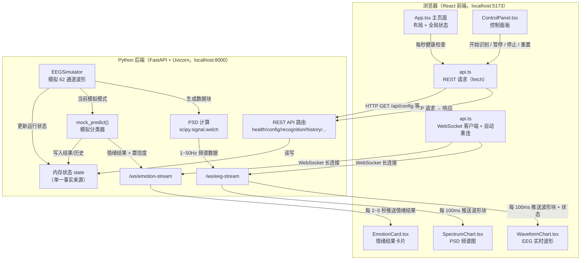

# 文档 03：系统架构（System Architecture）

> 适用读者：理解了需求与范围（文档 02）的初学者。本文件回答：**这套系统由哪几部分组成、它们怎么通信、数据是怎么从"生成"流到"显示"的。**

先给三个本文件反复用到的基础概念（同样遵守"首次出现给解释"的约定）：

| 术语 | 中文 | 英文 | 人话解释 | 本项目中的作用 |
|---|---|---|---|---|
| 前后端分离 | 前后端分离架构 | Frontend/Backend Separation | 网页界面（前端）和数据处理（后端）是两个独立程序，各自运行、通过接口通信 | 前端跑在 5173 端口，后端跑在 8000 端口，互不依赖 |
| 单一事实来源 | 单一事实来源 | Single Source of Truth | 同一个状态只由一个地方来定义和修改，避免两个地方存的状态不一致 | 后端内存中的 `state` 是"是否在识别/是否暂停/当前结果"的唯一权威 |
| 心跳 / 健康检查 | 心跳 / 健康检查 | Health Check / Heartbeat | 定期问一句"你还在吗"，用来判断对方是否在线 | 前端定时调用 `/api/health` 判断后端是否连接 |

---

## 1. 总体架构图（Mermaid）



**第一版只有两条常开管道：** 后端通过 `/ws/eeg-stream` 持续推波形，通过 `/ws/emotion-stream` 在识别时推情绪结果；其余一次性操作全部走 REST。

---

## 2. 前后端职责边界（Who Does What）

| 事项 | 谁负责 | 说明 |
|---|---|---|
| 生成模拟 EEG 数据 | **后端** | 前端不生成任何数据，杜绝"前端造假" |
| 计算 PSD | **后端** | 用 SciPy 计算，前端只负责画图 |
| 情绪识别（模拟） | **后端** | 前端只展示结果 |
| 系统运行状态（识别中/暂停/停止） | **后端** | 后端 `state` 是唯一权威，前端通过接口/推送获取 |
| 页面布局与交互 | **前端** | 按钮、下拉框、图表渲染 |
| 连接状态显示 | **前端（但数据来源是后端）** | 前端调用 `/api/health` 判断后端在线，而不是假装在线 |
| 历史记录存储 | **后端（内存）** | 前端从 `/api/history` 读取，通过 `DELETE /api/history` 清空 |
| 断线重连 | **前端** | 后端无感知，前端自动重试 |

**边界铁律（写进代码评审标准）：**
1. 前端任何"后端是否在线 / 是否识别中 / 数据源是什么"的显示，都必须来自后端接口或推送，**不允许**前端本地编造；
2. 后端输出的所有识别结果都必须带 `model_name` 与 `data_source` 字段，前端原样展示，不得改写。

---

## 3. REST API 与 WebSocket 的职责差异

| 维度 | REST API | WebSocket |
|---|---|---|
| 通信方式 | 一问一答（请求 → 响应） | 一条常开的双向管道 |
| 适合场景 | 一次性操作：开始识别、停止识别、取配置、取历史 | 持续推送：波形流、情绪结果流 |
| 频率 | 偶尔（用户点击、轮询健康状态） | 高频（每 100 ms 推波形） |
| 连接状态 | 无状态，每次独立 | 有连接生命周期，需要管理断开/重连 |
| 第一版端点 | `/api/health`、`/api/config` 等 | `/ws/eeg-stream`、`/ws/emotion-stream` |
| 比喻 | 打电话问一句挂掉 | 视频通话，一直连着说话 |

**约定：**
- 需要"实时、连续、后端主动"的数据 → WebSocket；
- 需要"用户主动触发、偶尔一次"的操作 → REST；
- 同一件事不要两种方式都实现，避免状态不同步。

---

## 4. 完整数据流：从"开始识别"到"显示结果"

以"点击「开始识别」"为起点，走一遍全链路（第一版）：

```text
[前端] 用户点击「开始识别」
   ↓  api.ts 发送 POST /api/recognition/start  { model: "模拟分类器", feature_type: "raw" }
[后端] REST 路由收到请求
   ↓  校验参数 → 设置 state["recognition_running"] = True → 记日志
   ↓  返回 { "status": "ok", "recognizing": true, ... }
[前端] 收到响应 → 「开始识别」按钮进入 loading/禁用 → 顶部模式不变 → 日志加一条
   ↓  （波形推送本就在进行，识别只是"开始使用波形做判断"）
[后端] /ws/eeg-stream 异步循环每 100ms：
   ├── EEGSimulator 生成一块 62 通道 × 25 点 数据
   ├── 取 8 个代表通道 → 推给前端（波形图 + PSD 图更新）
   └── 若识别中，把当前窗口数据交给 mock_predict()
[后端] /ws/emotion-stream：每 2~5 秒
   ├── mock_predict() 基于"当前模拟模式 + 小幅扰动"输出
   │    { emotion, emotion_zh, confidence, model_name, data_source, timestamp }
   ├── 写入 state["current_result"] 并追加到 state["history"]（最多 10 条）
   └── 推送给前端
[前端] /ws/emotion-stream 收到结果：
   ├── EmotionCard 更新：大字情绪 + 置信度 + 进度条 + 来源 + 时间
   ├── 历史记录表格更新（最近 10 条）
   └── 日志加一条 "[时间] 已完成一次情绪识别：平静，置信度 82%"
```

**状态同步规则：** 前端 `isRecognizing` 永远由 `POST /api/recognition/start|stop` 的响应 + WebSocket 里的 `status` 消息维护，不依赖前端本地计时。

---

## 5. 模拟数据流 vs 未来真实 SEED 数据流

| 环节 | 第一版（模拟流） | 未来（真实 SEED 流） |
|---|---|---|
| 数据来源 | `EEGSimulator` 实时合成 | 读取用户选择的 SEED `.mat` 文件（离线/按文件回放） |
| 波形 | 合成正弦波 + 噪声 | 真实脑电记录（含噪声、伪迹，需预处理） |
| 特征 | 直接展示波形 + 计算 PSD | PSD → 训练好的 SVM 特征输入 |
| 模型 | `mock_predict()` | 加载 `.joblib` 的已训练 SVM → 真实预测 |
| 标签可信度 | 仅演示，不代表真实情绪 | 仍是"模型的预测"，不代表临床结论 |
| 通道数 | 8 个代表通道展示 | 62 通道（可选性能模式） |
| 依赖 | NumPy + SciPy | + `scikit-learn`、`joblib`（第二版加入） |

**关键洞察：两套数据流的"管道"（前端、通信、图表、结果卡片）完全一样，只是后端"数据源 + 模型"两个模块被替换。** 这正是第一版把 `EEGSimulator` 与 `mock_predict` 做成独立函数/模块的原因——后续替换时前端几乎不用改。

---

## 6. 模块之间的依赖关系

```text
main.py（后端）
 ├─ 常量 / 通道名            （无依赖）
 ├─ Pydantic 响应模型        （依赖 FastAPI/Pydantic）
 ├─ state 内存状态           （无依赖，被所有模块读写）
 ├─ EEGSimulator            （依赖 NumPy、state）
 ├─ PSD 计算函数            （依赖 SciPy、EEGSimulator 的窗口数据）
 ├─ mock_predict()          （依赖 state、窗口统计）
 ├─ REST 端点               （依赖 state、各函数）
 └─ WebSocket 端点          （依赖 EEGSimulator、PSD、mock_predict、state）

frontend/src
 ├─ types.ts                （无依赖）
 ├─ api.ts                  （依赖 types.ts）
 ├─ App.tsx                 （依赖 api.ts、types.ts、各子组件）
 ├─ WaveformChart.tsx       （依赖 ECharts、types.ts）
 ├─ SpectrumChart.tsx       （依赖 ECharts、types.ts）
 ├─ EmotionCard.tsx         （依赖 Ant Design、types.ts）
 └─ ControlPanel.tsx        （依赖 Ant Design、api.ts）
```

**依赖规则：**
- 前端只依赖后端提供的接口与消息格式，不依赖后端内部实现；
- 后端模块之间尽量"上层函数调用下层函数"，不绕圈；
- 模拟模块与未来真实模块通过**同一份接口签名**（见文档 05/06）对接，便于替换。

---

## 7. 为什么第一版选 SVM 接口而不先做 CNN / Transformer？

| 理由 | 说明 |
|---|---|
| 数据量匹配 | SVM 是"小数据也能训练"的经典模型，适合 SEED 这类中等规模数据集；CNN/Transformer 需要大量数据与算力，且超参数调优复杂 |
| 学习成本 | SVM 原理（找分界线）远比"注意力机制""卷积核"好讲，适合课程答辩时给老师一句话讲清 |
| 依赖轻量 | SVM 用 `scikit-learn` + `joblib` 即可；CNN 需要 TensorFlow/PyTorch，环境重、GPU 不确定 |
| 可解释性 | SVM 的决策边界和特征权重相对可解释，方便画图说明"哪个频段特征影响情绪判断" |
| 第一版策略 | 第一版连 SVM 都不训练，只定义 `EmotionClassifier.predict()` 抽象接口，由 `mock_predict()` 实现；这样后续 `SVMEmotionClassifier` 实现同一个接口即可无缝替换 |

**接口预留示例（第二版真实实现要符合这个形状）：**

```python
# 第一版只作为"接口约定"的说明，不创建无用的抽象文件；见文档 06
class EmotionClassifier:
    """未来所有分类器（模拟/SVM/CNN）的统一入口约定。"""
    def predict(self, eeg_window, feature_type):  # -> EmotionResult
        ...
```

> 第一版里这个类**以注释 / TODO 形式存在于 `main.py`**，而不是新建 `classifier.py` 空文件。理由见文档 07 的最小化原则。

---

## 8. 架构上不做什么（避免过度设计）

1. 不拆微服务、不引入消息队列、不用 Redis 缓存；
2. 不建数据库——历史记录只存后端内存；
3. 不在后端建 `routers/ services/ repositories/` 多层目录——第一版全部在 `main.py`，用清晰分区；
4. 不做认证、不做 CORS 安全加固之外的复杂中间件（本地 Demo 允许简单 CORS 配置即可）。

---

> 下一篇：**`docs/04_ui_ux_spec.md`（UI/UX 规范）**，把界面每个区域、每个控件讲清楚。
